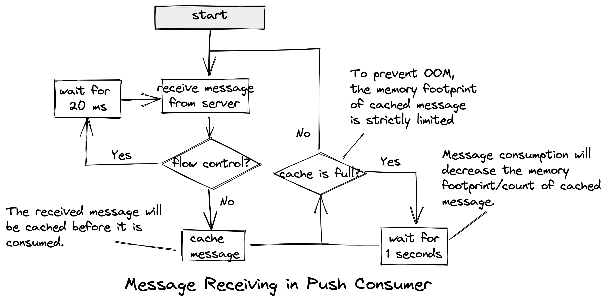

# Workflow

This document elaborates the unified workflow of client. The specific implementations maybe differ from language to language, but they follow the same workflow.

## Startup

The new version of the client adds startup preparations that differ from those of previous versions. These changes have the benefit of catching more obvious errors or exceptions earlier in the process. The preparations consist of attempts to retrieve topic route data and obtain settings from the server, which can perform hot updates on these settings. This process is referred to as server-client telemetry. If any of these preparations fail, the client startup will also fail.

In details, the **server-client telemetry** provides a channel to upload the local settings and to overwrite the client settings.

## Periodic Task

The client performs same tasks periodically.

* Update topic route data and cache it. The subsequent request could get route from cache directly.
* Send heartbeat to keep alive.
* Send **server-client telemetry** request. Client settings may be overwritten by telemetry response.

## Message Flow in Producer

The workflow to publish a single message of NORMAL type. The message publishing of other types and publishing of batch messages is similar to it. Some special cases will be explained later.

The following steps comprise the message publishing procedure:

1. Check if the topic route is already cached.
2. If the topic route is not cached, attempt to fetch it from the server; otherwise, proceed to step 4.
3. If the attempt to fetch the topic route fails, return a failure and end the process. Otherwise, cache the topic route and proceed to the next step.
4. Select writable candidate message queues from the topic route to publish the message.
5. If the type of message queue does not match the message type, return a failure and end the process.
6. Attempt to publish the message.
7. If the message is published successfully, return a success and end the process.
8. In case of failed message publishing, catch the error information.
9. If the maximum number of attempts has been reached, return a failure and end the process. Otherwise, decide whether to retry based on the error type.
10. If there is no need to retry, return a failure and end the process. Otherwise, proceed to the next step.
11. Isolate the current endpoint for publishing.
12. Rotate to the next message queue to publish the message and go back to step 6.

> **Note**: If message publishing fails, the endpoint will be isolated to limit its selection for load balancing. A periodic heartbeat will check the health status of the isolated endpoint and remove it from isolation if no further exceptions are detected.

For TRANSACTIONAL messages, the publishing will not be retried if failure is encountered. The ordering of FIFO message is based on the assumption that messages which have the same `message group` will be put into the same message queue, thus the message queue to publish is not disturbed by the isolated endpoint([SipHash](https://en.wikipedia.org/wiki/SipHash) algorithm is used to calculate the message queue index for FIFO message publishing).

About the message publishing retry policy when failure is encountered, in order to ensure the timeliness of message publishing, the next attempt would be executed immediately in most case if flow control does not encountered. Actually the server would deliver the explicit retry policy flow control for each producer while publishing flow control occurs.

## Message Flow in Push Consumer

### Message Receiving in Push Consumer

The receiving procedure is as follows:

1. Fetch the latest queue assignment from server.
2. If flow control occurs during message receiving, consumer will retry after 20 milliseconds, otherwise go to step3.
3. Cache message and trigger the consumption(Once the lifecycle of message is over, it will removed from cache immediately).
4. Check the cache is full, consumer will try to receive message immediately, otherwise retry after 1 seconds.

### Message Consumption in Push Consumer(Non-FIFO)

### Message Consumption in Push Consumer(FIFO)

## Message Flow in Simple Consumer

